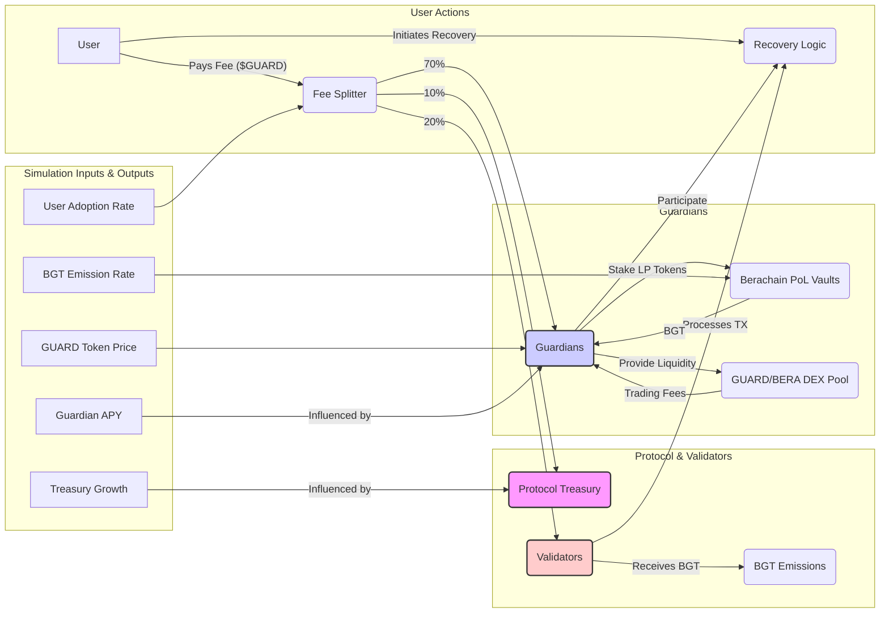
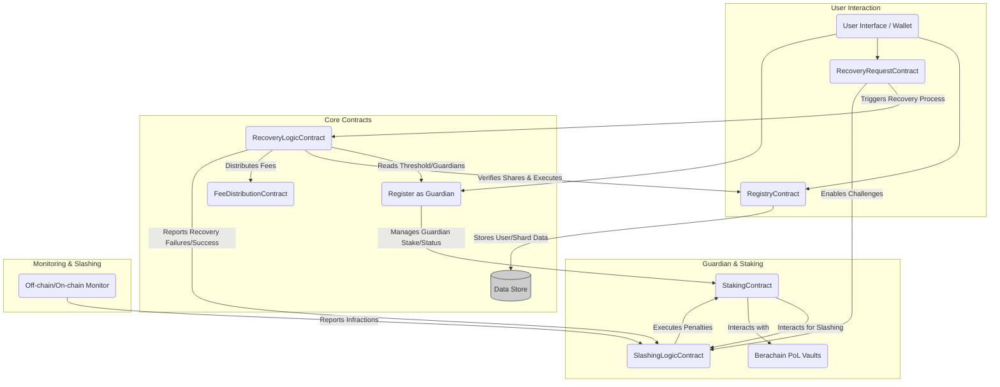
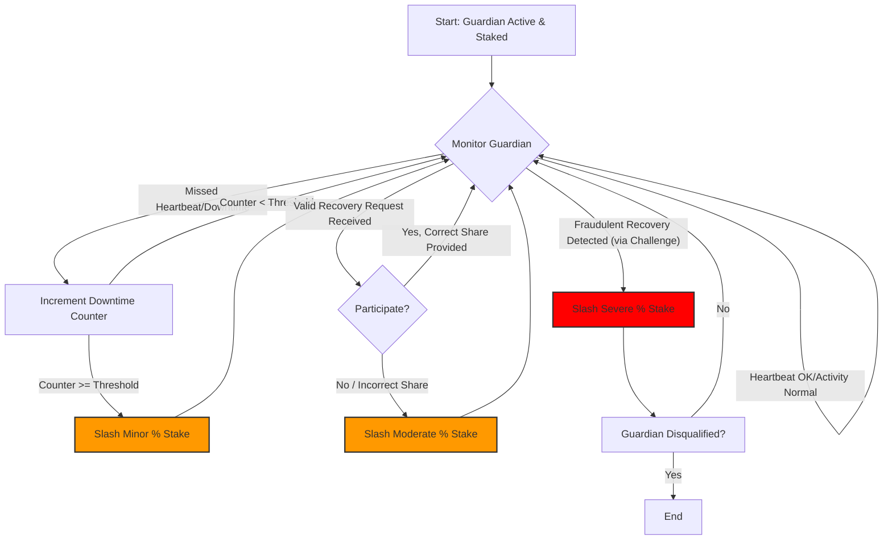
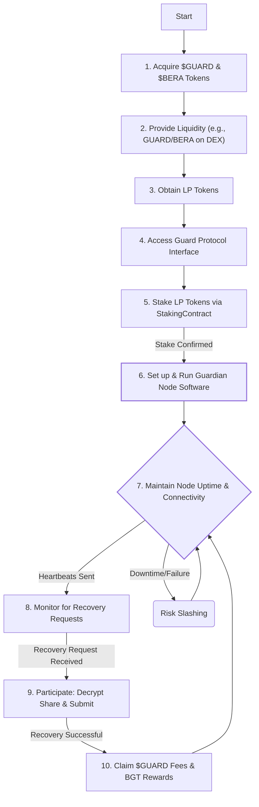
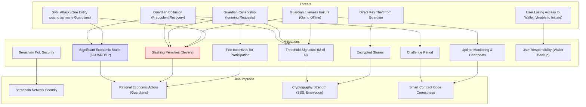

# Guard Protocol Whitepaper v2

**Decentralized Key Recovery with Built-In Economic Incentives on Berachain**

## 1. The Problem: Why Self-Custody Fails (And Existing Solutions Fall Short)

### 1.1 The Pain Points

An estimated 20% of all Bitcoin is permanently lost, primarily due to key mismanagement (Chainalysis, 2023). This highlights a critical vulnerability in the digital asset ecosystem. Users face a difficult choice:

- **Self-Custody Risks:** Managing private keys is prone to error, loss, or theft.
- **Multisig Complexity:** Requires technical expertise and coordination, hindering adoption.
- **Social Recovery Flaws:** Relies on the goodwill and availability of trusted contacts, lacking concrete incentives and potentially introducing social engineering risks.
- **Centralized Custodians:** Creates single points of failure and censorship risk, undermining the core principles of decentralization (e.g., FTX collapse).

### 1.2 The Missing Piece: Sustainable Incentives

Existing decentralized recovery methods often fail because they lack robust, long-term economic incentives. Guardians need compelling reasons to reliably store key shares and participate in recovery, validators need compensation for processing recovery transactions, and users need strong guarantees about the durability of their backup. Altruism is not a sustainable security model.

## 2. The Solution: Guard Protocol - Incentive-Driven Recovery

Guard Protocol provides a decentralized, secure, and user-friendly key recovery solution built on Berachain, leveraging its unique Proof-of-Liquidity (PoL) consensus mechanism.

**Core Components:**

- ✔ **Shamir's Secret Sharing (SSS):** User's private key is split into multiple unique, encrypted shares (e.g., 5 shares, requiring 3 for recovery).
- ✔ **Decentralized Guardian Network:** Shares are distributed across a network of independent, economically incentivized Guardians.
- ✔ **$GUARD Token:** The native utility and governance token, facilitating payments and aligning participant incentives.
- ✔ **Berachain PoL Integration:** Guardian incentives are deeply integrated with Berachain's BGT emissions, creating a powerful synergy between network security and recovery service reliability.

## 3. Economic Model: Aligning Incentives

### 3.1 The $GUARD Token

- **Total Supply:** 1 Billion (fixed)
- **Use Cases:**
  - **User Fees:** Paying for key backup storage and recovery services.
  - **Governance:** Voting on protocol parameters, upgrades, and treasury allocation.
  - **Guardian Staking:** Guardians stake $GUARD (potentially via LP tokens like $GUARD/BERA) to participate and earn rewards.
  - **Liquidity Mining:** Incentivizing DEX liquidity for the $GUARD token.
- **Distribution:**
  - **Guardians & PoL Rewards:** 40% (Long-term vesting, e.g., 5-year linear) - Rewards long-term participation and aligns with Berachain PoL.
  - **Liquidity Mining:** 30% (Unlocked strategically, potentially partially at TGE) - Bootstrap initial DEX liquidity.
  - **Team & Development:** 15% (Standard vesting, e.g., 1-year cliff, 3-year linear) - Fund core development.
  - **DAO Treasury:** 15% (Governance-controlled) - Future ecosystem grants, audits, operational costs, and potential early adoption incentives.

### 3.2 Fee Structure & Value Flow

When a user initiates a recovery (example fee: 100 $GUARD):

- **Guardians (Distributed):** ~70 $GUARD - Compensates participating Guardians for secure storage, uptime, and successful recovery participation.
- **Validators:** ~20 $GUARD - Incentivizes validators to prioritize and include recovery-related transactions in blocks.
- **Protocol Treasury:** ~10 $GUARD - Funds ongoing development, security audits, and ecosystem growth.

_(Note: Fees are illustrative and subject to governance adjustment)._

### 3.3 Guardian Economics: Why Participate?

Guardians are permissionless entities who stake collateral ($GUARD or $GUARD LP tokens) to secure the network and provide the recovery service. They earn revenue through multiple streams:

1.  **$GUARD Recovery Fees:** Direct payment for participating in successful recoveries (70% fee share).
2.  **Berachain BGT Rewards:** By staking $GUARD/BERA LP tokens (or similar) into Berachain's PoL vaults, Guardians earn BGT emissions, convertible to BERA, aligning them directly with securing the underlying Berachain network.
3.  **DEX Trading Fees:** Earned from providing liquidity for $GUARD pairs.

**Guardian ROI depends on:** Stake size, $GUARD price, recovery volume, BGT emission rates, and DEX volume. The multi-faceted reward structure aims to provide attractive returns even during initial low-usage phases, supplemented heavily by PoL incentives. Reliability and uptime are crucial, enforced via smart contracts and slashing conditions.

### 3.4 Validator Economics: Why Include Recoveries?

Validators benefit from Guard Protocol's success:

1.  **$GUARD Recovery Fees:** Direct payment for including recovery transactions (20% fee share).
2.  **BGT Emissions:** Guard Protocol's PoL vault activity contributes to overall network health, potentially attracting more BGT bribes and emissions directed towards validators supporting the ecosystem. Validators are incentivized to process recovery transactions reliably to maintain the protocol's functionality and associated fee/BGT flows.

### 3.5 User Costs: Affordable Peace of Mind

- **Setup/Storage:** Minimal fee for initial key sharding and distribution.
- **Recovery Fee:** Designed to be competitive (e.g., target ~$10-20 worth of $GUARD), significantly cheaper than ongoing subscriptions for centralized services or the potential cost of lost assets.

Guard Protocol offers a decentralized, censorship-resistant alternative at a compelling price point compared to centralized options ($9.99+/month) or the gas overhead and complexity of user-managed multisig ($50+).

## 4. Security & Incentive Mechanisms

### 4.1 Slashing Conditions: Enforcing Honesty & Reliability

Significant economic penalties deter misbehavior:

- **Prolonged Downtime/Missed Heartbeats:** Gradual slashing of staked collateral.
- **Failure to Participate in Valid Recovery:** Moderate slashing of stake.
- **Attempting to Approve Fraudulent Recovery (Detected via Challenge):** Severe slashing (e.g., 50-100%) of staked collateral.

Slashing leverages the staked $GUARD or LP tokens, providing a direct economic incentive for guardians to remain online, responsive, and honest.

### 4.2 Collusion Resistance & Liveness

Guard Protocol employs multiple layers to mitigate collusion and ensure service availability:

- **Encryption:** Key shares are encrypted, preventing guardians from accessing the underlying key directly.
- **Threshold Requirement (M-of-N):** Requiring a subset (M) of the total (N) guardians ensures redundancy. (e.g., 3-of-5, or potentially over-sharded like 3-of-7 to improve liveness).
- **Challenge Period:** Recovery requests trigger a time-locked "challenge period" where the user (or potentially other guardians, if sophisticated fraud detection is implemented) can cryptographically dispute a fraudulent attempt before execution, triggering slashing for malicious actors.
- **Economic Disincentives:** The potential loss of significant staked capital via slashing outweighs the potential gains from most forms of collusion or fraud.
- **Guardian Uptime Monitoring:** Smart contracts monitor guardian responsiveness (e.g., heartbeats), linking uptime directly to rewards and slashing conditions.

### 4.3 Guardian Quality & Onboarding

The protocol relies primarily on **economic incentives** rather than centralized vetting. Any entity can become a guardian by meeting the minimum stake requirement. The high collateral and risk of slashing serve as the primary filter, ensuring only participants with significant economic commitment participate, strongly incentivizing reliability and honest behavior.

## 5. Bootstrapping & Go-To-Market

Achieving initial adoption is crucial. Our strategy includes:

- **Strategic Partnerships:** Integrating Guard Protocol directly into popular Berachain wallets, dApps, and potentially bridges/onramps to make setup seamless for users.
- **Early Incentive Programs:** Utilizing portions of the Liquidity Mining allocation and potentially DAO Treasury funds to offer enhanced rewards for early guardians and potentially subsidized setup fees for initial users.
- **Community Building:** Engaging developers and users through grants, documentation, and educational content.
- **Phased Rollout:** Launching first on Testnet allows for refinement before a gradual Mainnet deployment.

The long-term vesting for Guardian/PoL rewards (40% of supply over 5 years) is specifically designed to attract and retain committed, long-term guardians crucial for the network's stability beyond initial speculative interest.

## 6. Roadmap & Projections

_(Note: Projections are illustrative, based on internal modeling, and highly dependent on market conditions, Berachain ecosystem growth, and successful strategy execution. Actual results may vary significantly.)_

### 6.1 Illustrative Adoption Scenarios

| Year | Potential Users | Illustrative $GUARD Price | Potential Guardian APY (Fee + PoL) |
| :--- | :-------------- | :------------------------ | :--------------------------------- |
| 2024 | 10,000          | $0.05                     | 15-25%                             |
| 2025 | 100,000         | $0.20                     | 25-40%                             |
| 2026 | 1M+             | $0.75+                    | 40%+                               |

### 6.2 Key Milestones

- **Q3 2024:** Public Testnet Launch (aligned with Berachain testnet phases).
- **Q4 2024/Q1 2025:** Mainnet Launch on Berachain (supporting Berachain native keys).
- **Mid-2025:** Support for importing/recovering keys for major assets (e.g., Bitcoin, EVM chains via derived keys).
- **Late-2025:** Exploration of cross-chain recovery initiation (e.g., trigger recovery from Ethereum).

## 7. Complexity & Auditing

We acknowledge the technical complexity involved in building a secure SSS implementation, robust slashing logic, and seamless PoL integration. Mitigation strategies include:

- **Multiple Independent Audits:** Engaging reputable security firms to audit all smart contracts before mainnet launch and after major upgrades.
- **Open-Source Code:** Allowing community review and scrutiny.
- **Phased Rollout:** Iterative development and deployment starting with testnet.
- **Focus on User Experience:** Abstracting underlying complexity to provide a simple interface for end-users.

## 8. Conclusion: Towards Sustainable Self-Custody

Guard Protocol addresses the critical need for reliable, decentralized key recovery by creating a self-sustaining ecosystem built on Berachain. By tightly aligning the economic incentives of users, guardians, and validators using the $GUARD token and Berachain's Proof-of-Liquidity, we can finally make self-custody practical and secure for the broader crypto community.

**Join Us:**

- Website: [guardprotocol.xyz](https://guardprotocol.xyz) (placeholder)
- Twitter: @GuardProtocol (placeholder)
- Discord/Telegram: (Link to be added)

**Build with Us:** Developer grants available via the DAO Treasury.

## Appendices

### A1: Detailed Tokenomics Simulation Parameters & Sensitivity Analysis

_Concept:_ This diagram illustrates the flow of value within the Guard Protocol ecosystem and the key variables influencing Guardian returns.

_Description:_ This flowchart shows users paying fees into a Fee Splitter. The splitter distributes $GUARD to Guardians, Validators, and the Treasury. Guardians stake LP tokens in PoL vaults to earn BGT and also earn fees from DEX liquidity. Validators earn fees and BGT. Simulation inputs like adoption and price affect outputs like Guardian APY.

### A2: Smart Contract Architecture & Slashing Logic Details

_Concept 1: High-Level Contract Interaction_

_Description 1:_ Shows key contracts: Registry (user data), RecoveryRequest (initiation), RecoveryLogic (core process), GuardianContract (guardian management), StakingContract (stake handling), SlashingLogic, and FeeDistribution. Arrows indicate primary interactions.

_Concept 2: Slashing Logic Flow_

_Description 2:_ Illustrates the decision flow for slashing: Monitoring leads to checks for downtime, participation failure, or detected fraud, each potentially triggering different levels of stake slashing.

### A3: Guardian Setup & Operations Guide

_Concept:_ A step-by-step flowchart for becoming and operating as a Guardian.

_Description:_ Shows the lifecycle: acquiring tokens, providing liquidity, staking, running the node, maintaining uptime, participating in recoveries, and claiming rewards, while noting the risk of slashing for failures.

### A4: Formal Security Model & Assumptions

_Concept:_ Diagram illustrating potential threats and the corresponding mitigation mechanisms within the Guard Protocol design.

_Description:_ Maps identified threats (Collusion, Censorship, Liveness Failure, Sybil, Theft) to the protocol's mitigation strategies (Thresholding, Encryption, Staking, Slashing, Challenge Period, Monitoring, Fees). It also links mitigations to underlying assumptions (Network Security, Rationality, Crypto Strength, Code Correctness).
